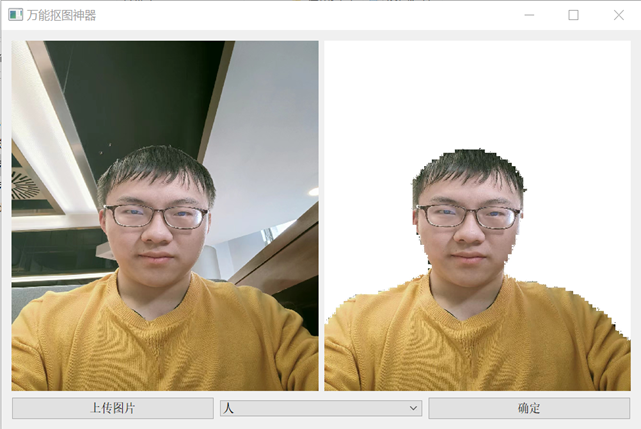

# 项目介绍

这是一个基于pspnet的抠图工具，用户可以从本地上传一张图片， 然后从包括飞机、自行车、汽车、公交车、火车、船、摩托车、自行车、牛、羊、猫、狗、鸟、人等类别中选取一个类别，然后系统将会从原图中将这些类别的元素抠取出来。

# 项目原理

基于pspnet对图片进行语义分割。使用pyqt技术开发界面，然后对于用户上传的图片，进行语义分割，将原图和语义分割的结果进行逐像素点比较，如果语义分割像素点位置上的（R, G, B）三元值等于用户选择的类别对应的颜色，则原图该像素点不变，负责，将原图该像素点变为（255， 255， 255）即白色，这样就实现图像的抠取。展示如下：

